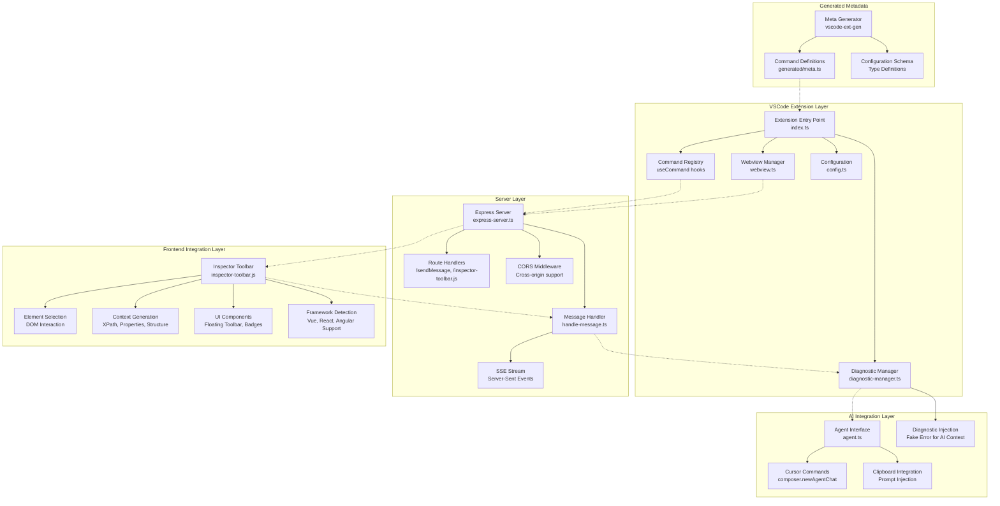

# Architecture Diagram - System Components

This diagram shows the overall system architecture with all major components and their relationships.

## Component Descriptions

### VSCode Extension Layer
- **Extension Entry Point**: Main extension activation and lifecycle management
- **Webview Manager**: UI panel management with reactive state
- **Command Registry**: VSCode command registration and handling
- **Diagnostic Manager**: Error injection for AI context provision
- **Configuration**: Typed configuration management

### Server Layer
- **Express Server**: HTTP server for frontend communication
- **Route Handlers**: API endpoints for toolbar script and messaging
- **CORS Middleware**: Cross-origin request support
- **Message Handler**: SSE stream management and prompt processing
- **SSE Stream**: Real-time communication with frontend

### Frontend Integration Layer
- **Inspector Toolbar**: Custom web component for element inspection
- **Element Selection**: DOM event handling and element highlighting
- **Context Generation**: XPath generation and element property extraction
- **UI Components**: Visual feedback with animated badges and toolbar
- **Framework Detection**: Support for Vue, React, Angular, and Svelte

### AI Integration Layer
- **Agent Interface**: Cursor AI command execution interface
- **Cursor Commands**: Integration with Cursor's composer functionality
- **Clipboard Integration**: Prompt injection via clipboard manipulation
- **Diagnostic Injection**: Creative use of VSCode diagnostics for AI attention

### Generated Metadata
- **Meta Generator**: Automated generation of command and config definitions
- **Command Definitions**: Type-safe command registration
- **Configuration Schema**: Typed configuration with validation

## Data Flow Patterns

### Command Flow
1. User triggers command → Command Registry → Server/AI Integration
2. Server operations → Express Server → Route Handlers → Frontend

### Inspection Flow
1. Frontend interaction → Inspector Toolbar → Element Selection
2. Context generation → Message Handler → Diagnostic Injection → AI

### Configuration Flow
1. Generated Metadata → Extension Entry Point → Configuration Management
2. User settings → Configuration → Server/Frontend behavior 