# Call Stack Diagram - Function Call Hierarchy

This diagram shows the call stack flow from user interaction to AI response generation.

```mermaid
graph LR
    subgraph "Call Stack: Element Selection to AI Response"
        A[User Clicks Element] --> B[handleElementClick]
        B --> C[selectElement]
        C --> D[generateXPath]
        D --> E[createBadge]
        E --> F[Element Context Built]
    end
    
    subgraph "Call Stack: Prompt Submission"
        G[handlePromptSubmit] --> H[buildHierarchicalStructure]
        H --> I[buildElementInfo]
        I --> J[getVueComponentsInfo]
        J --> K[formatPrompt]
        K --> L[callAI]
    end
    
    subgraph "Call Stack: Server Communication"
        L --> M[fetch /sendMessage]
        M --> N[handleMessage middleware]
        N --> O[injectPromptWithCallback]
        O --> P[injectPromptDiagnosticWithCallback]
        P --> Q[Create Diagnostic]
        Q --> R[executeCommand composer.fixerrormessage]
    end
    
    subgraph "Call Stack: VSCode Integration"
        R --> S[Cursor AI Activation]
        S --> T[AI Context Processing]
        T --> U[Code Generation]
        U --> V[Response to User]
    end
    
    F --> G
    
    style A fill:#ffcdd2
    style G fill:#f8bbd9
    style M fill:#e1bee7
    style S fill:#c8e6c9
```

## Call Stack Analysis

### Element Selection Stack
1. **User Clicks Element**: DOM event triggered by user interaction
2. **handleElementClick**: Event handler processes click event
3. **selectElement**: Adds element to selection map with unique color
4. **generateXPath**: Creates unique XPath selector for element
5. **createBadge**: Creates visual indicator badge for selected element
6. **Element Context Built**: Complete element information ready

### Prompt Submission Stack
1. **handlePromptSubmit**: User submits prompt with selected elements
2. **buildHierarchicalStructure**: Organizes selected elements in tree structure
3. **buildElementInfo**: Extracts comprehensive element information
4. **getVueComponentsInfo**: Detects and extracts Vue component details
5. **formatPrompt**: Combines user prompt with element context
6. **callAI**: Initiates communication with backend server

### Server Communication Stack
1. **fetch /sendMessage**: HTTP POST request to Express server
2. **handleMessage middleware**: Express route handler processes request
3. **injectPromptWithCallback**: Prepares prompt for VSCode integration
4. **injectPromptDiagnosticWithCallback**: Creates diagnostic entry
5. **Create Diagnostic**: Generates fake error for AI attention
6. **executeCommand composer.fixerrormessage**: Triggers Cursor AI

### VSCode Integration Stack
1. **Cursor AI Activation**: AI system receives diagnostic context
2. **AI Context Processing**: AI analyzes element context and user prompt
3. **Code Generation**: AI generates appropriate code solution
4. **Response to User**: Generated code presented to developer

## Key Function Details

### Frontend Functions
- **handleElementClick**: Prevents default behavior, manages selection state
- **selectElement**: Assigns colors, creates badges, updates selection map
- **generateXPath**: Creates robust element selectors for reliable targeting
- **buildElementInfo**: Extracts properties, attributes, text content, structure

### Server Functions
- **handleMessage**: Sets up SSE headers, processes prompt data
- **injectPromptWithCallback**: Manages diagnostic lifecycle
- **injectPromptDiagnosticWithCallback**: Creates temporary diagnostic entries

### Integration Functions
- **executeCommand**: Bridges to VSCode command system
- **composer.fixerrormessage**: Activates Cursor AI with context
- **Diagnostic Management**: Creates/clears fake errors for AI attention

## Error Handling

Each call stack level includes error handling:
- **Frontend**: Try-catch blocks around DOM operations
- **Server**: Express error middleware and response handling
- **VSCode**: Diagnostic cleanup and command execution safety
- **AI Integration**: Fallback mechanisms for command failures 