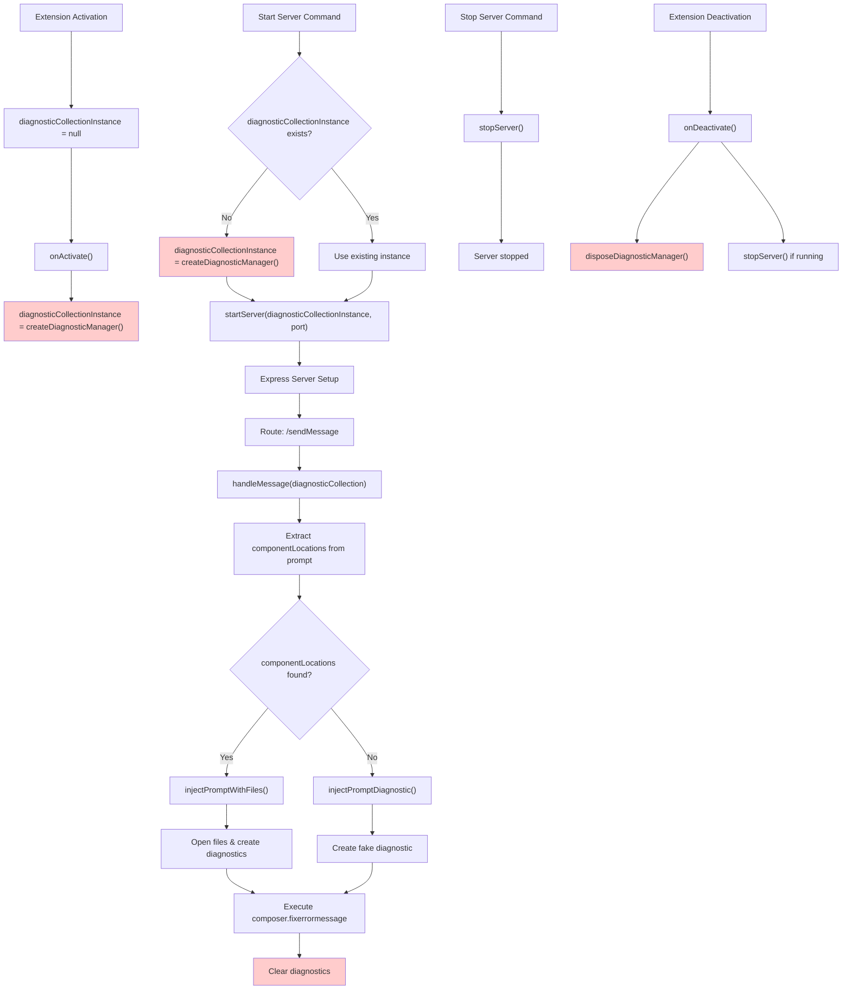

# DiagnosticCollectionInstance Data Flow Analysis

## Data Flow Diagram



## Logical Inconsistencies Identified

### 1. **Duplicate Initialization** 🔴
**Location**: `src/index.ts` lines 52 and 100
```typescript
// In startServer command (line 52)
if (!diagnosticCollectionInstance) {
  diagnosticCollectionInstance = createDiagnosticManager()
}

// In onActivate (line 100)
diagnosticCollectionInstance = createDiagnosticManager()
```

**Problem**: The diagnostic collection is created twice:
- Once in `onActivate()` (always)
- Once in `startServer` command (if null)

**Impact**: This creates a memory leak because the first instance is never disposed before creating the second one.

### 2. **Race Condition** ⚠️
**Scenario**: If user runs `startServer` command before extension activation completes:
1. `startServer` creates diagnosticCollectionInstance
2. `onActivate` overwrites it with a new instance
3. The first instance is never disposed

### 3. **Inconsistent Null Checking** 🔴
**Location**: `src/index.ts` line 51 vs line 100
```typescript
// startServer checks for null
if (!diagnosticCollectionInstance) {
  diagnosticCollectionInstance = createDiagnosticManager()
}

// onActivate doesn't check - always creates new
diagnosticCollectionInstance = createDiagnosticManager()
```

**Problem**: `onActivate` unconditionally creates a new instance, ignoring any existing one.

### 4. **Missing Import Error** 🔴
**Location**: `src/index.ts` line 4
```typescript
import { createDiagnosticManager, disposeDiagnosticManager, injectPromptAndFix } from './diagnostic-manager'
```

**Problem**: `injectPromptAndFix` is imported but doesn't exist in `diagnostic-manager.ts`. The actual functions are:
- `injectPromptDiagnostic`
- `injectPromptWithFiles`

### 5. **Potential Memory Leak in Server Lifecycle** ⚠️
**Problem**: When server stops, the `diagnosticCollectionInstance` remains active but is no longer used until server restarts or extension deactivates.

## Recommended Fixes

### Fix 1: Single Initialization Pattern
```typescript
// Remove duplicate initialization in onActivate
onActivate(async () => {
  try {
    // Don't create here - let startServer handle it
    // diagnosticCollectionInstance = createDiagnosticManager() // REMOVE THIS
  }
  catch (error) {
    window.showErrorMessage(`${CONFIG.MESSAGES.ACTIVATION_ERROR}: ${error}`)
  }
})
```

### Fix 2: Fix Import Error
```typescript
// Remove unused import
import { createDiagnosticManager, disposeDiagnosticManager } from './diagnostic-manager'
```

### Fix 3: Proper Lifecycle Management
```typescript
function ensureDiagnosticManager(): DiagnosticCollection {
  if (!diagnosticCollectionInstance) {
    diagnosticCollectionInstance = createDiagnosticManager()
  }
  return diagnosticCollectionInstance
}

// Use in startServer
const diagnosticManager = ensureDiagnosticManager()
serverInstance = await startServer(diagnosticManager, configuredPort)
```

### Fix 4: Cleanup on Server Stop
```typescript
useCommand(commands.stopServer, async () => {
  try {
    if (!serverInstance) {
      window.showInformationMessage('Server is not running.')
      return
    }

    await stopServer(serverInstance)
    serverInstance = null

    // Optional: Dispose diagnostic manager when server stops
    if (diagnosticCollectionInstance) {
      disposeDiagnosticManager(diagnosticCollectionInstance)
      diagnosticCollectionInstance = null
    }

    webview.clearError()
    webview.serverStatus.value = 'stopped'
    window.showInformationMessage('Frontend Context server stopped.')
  }
  catch (error) {
    const errorMessage = error instanceof Error ? error.message : String(error)
    window.showErrorMessage(`Failed to stop server: ${errorMessage}`)
  }
})
```

## Summary

The main issues are:
1. **Duplicate initialization** causing memory leaks
2. **Race conditions** between activation and command execution
3. **Missing import** causing compilation errors
4. **Inconsistent lifecycle management** of the diagnostic collection

These issues can lead to memory leaks, compilation errors, and unpredictable behavior in the extension.
