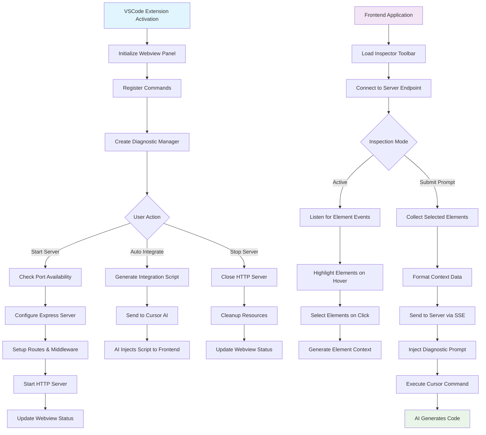

# Flowchart Diagram - System Process Flow

This diagram illustrates the decision points and process flow throughout the Frontend Context system.

## Process Flow Description

### Extension Initialization
- **Activation**: VSCode starts the extension
- **Setup**: Initialize webview, register commands, create diagnostic manager
- **Ready State**: Extension ready for user commands

### Server Management
- **Start Server**: Check port availability, configure Express, start HTTP server
- **Auto Integration**: Generate and inject inspector script via AI
- **Stop Server**: Clean shutdown and resource cleanup

### Frontend Integration
- **Toolbar Loading**: Inspector toolbar connects to server endpoint
- **Inspection Mode**: Listen for DOM events, highlight and select elements
- **Context Generation**: Build comprehensive element information

### AI Communication
- **Prompt Submission**: Collect selected elements and format context
- **Server Communication**: Send data via Server-Sent Events
- **AI Integration**: Inject diagnostic prompt and execute Cursor commands 