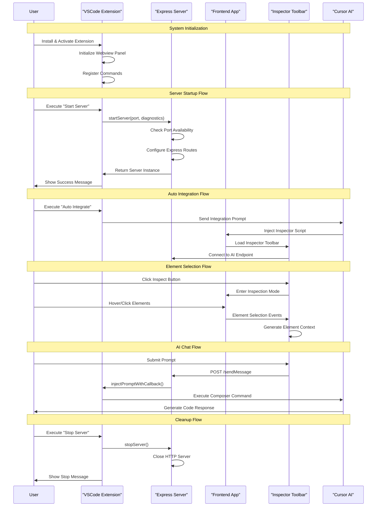

# Sequence Diagram - Frontend Context System Flow

This diagram shows the complete interaction flow between all system components from initialization to AI code generation.

## Key Interactions

1. **System Initialization**: Extension activation and command registration
2. **Server Startup**: HTTP server creation with port checking and route setup
3. **Auto Integration**: AI-assisted script injection into frontend applications
4. **Element Selection**: Interactive DOM element inspection and context generation
5. **AI Communication**: Prompt submission through SSE and diagnostic injection
6. **Cleanup**: Proper resource disposal and server shutdown 