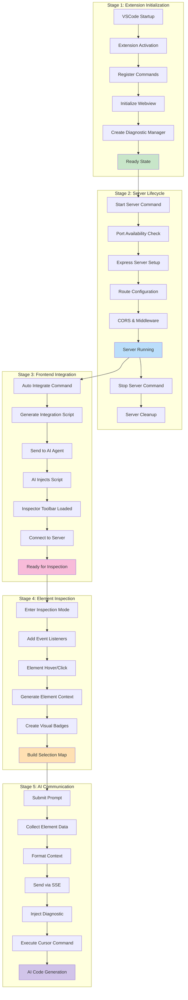

# Stage Diagram - System Execution Stages

This diagram illustrates the different execution stages of the Frontend Context system from initialization to code generation.

## Stage Descriptions

### Stage 1: Extension Initialization
**Purpose**: Bootstrap the VSCode extension and prepare core components

**Key Activities**:
- VSCode triggers extension activation on startup
- Extension entry point initializes reactive components
- Command registry sets up user-accessible commands
- Webview panel creates the UI interface
- Diagnostic manager prepares for AI integration
- System reaches ready state for user interaction

**Duration**: ~500ms during VSCode startup
**Dependencies**: VSCode API, reactive-vscode framework

### Stage 2: Server Lifecycle
**Purpose**: Manage the HTTP server for frontend communication

**Key Activities**:
- User executes "Start Server" command
- System checks configured port availability
- Express server instance created with middleware
- API routes configured for toolbar and messaging
- CORS enabled for cross-origin frontend access
- Server enters running state, ready for connections

**Duration**: ~1-2 seconds for startup
**Dependencies**: Express.js, port availability, network access

### Stage 3: Frontend Integration
**Purpose**: Inject inspector capabilities into frontend applications

**Key Activities**:
- User triggers "Auto Integrate" command
- System generates integration script with server endpoint
- Script sent to Cursor AI for intelligent injection
- AI analyzes project structure and injects script appropriately
- Inspector toolbar loads in frontend application
- Toolbar establishes connection to server endpoint

**Duration**: ~3-5 seconds (depends on AI response time)
**Dependencies**: Cursor AI, frontend application, network connectivity

### Stage 4: Element Inspection
**Purpose**: Enable interactive element selection and context gathering

**Key Activities**:
- User activates inspection mode via toolbar
- DOM event listeners attached for mouse interactions
- Elements highlighted on hover with visual feedback
- Click events capture element selection
- XPath and context information generated for each element
- Visual badges created to indicate selected elements

**Duration**: Real-time interaction (milliseconds per action)
**Dependencies**: DOM API, CSS styling, event handling

### Stage 5: AI Communication
**Purpose**: Process user prompts with element context and generate code

**Key Activities**:
- User submits prompt with selected elements
- System collects all element data and context
- Prompt formatted with hierarchical element structure
- Data sent to server via Server-Sent Events
- Server injects diagnostic prompt into VSCode
- Cursor AI command executed with full context
- AI generates code based on element context and user request

**Duration**: ~5-10 seconds (depends on AI processing)
**Dependencies**: SSE connection, VSCode diagnostics, Cursor AI

## Stage Dependencies

### Sequential Dependencies
1. **Stage 1 → Stage 2**: Extension must be initialized before server can start
2. **Stage 2 → Stage 3**: Server must be running before integration can occur
3. **Stage 3 → Stage 4**: Frontend integration required before inspection
4. **Stage 4 → Stage 5**: Element selection needed before AI communication

### Parallel Capabilities
- Multiple element selections can occur simultaneously in Stage 4
- Server can handle multiple frontend connections concurrently
- AI communication can process multiple prompts (queued)

## Error Recovery

### Stage Failures
- **Stage 1**: Extension reload required
- **Stage 2**: Port conflict resolution, retry with different port
- **Stage 3**: Manual script injection fallback
- **Stage 4**: Event listener re-attachment
- **Stage 5**: Diagnostic cleanup and retry mechanism

### Rollback Procedures
- Server shutdown cleans up all connections
- Extension deactivation disposes all resources
- Frontend integration can be reversed by removing script
- Diagnostic manager clears temporary error states 