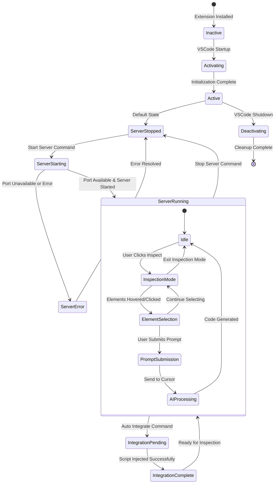

# State Diagram - System State Management

This diagram shows the various states of the Frontend Context system and the transitions between them.

## State Descriptions

### Extension States
- **Inactive**: Extension installed but not activated
- **Activating**: Extension starting up, initializing components
- **Active**: Extension fully operational, ready for commands
- **Deactivating**: Extension shutting down, cleaning up resources

### Server States
- **ServerStopped**: HTTP server not running, default state
- **ServerStarting**: Server initialization in progress
- **ServerRunning**: HTTP server active, accepting connections
- **ServerError**: Server failed to start (port conflict, etc.)

### Integration States
- **IntegrationPending**: Auto-integration command executed, waiting for AI
- **IntegrationComplete**: Inspector script successfully injected into frontend

### Inspection States (within ServerRunning)
- **Idle**: Waiting for user interaction
- **InspectionMode**: Element inspection active, listening for DOM events
- **ElementSelection**: Elements being selected and highlighted
- **PromptSubmission**: User prompt being processed
- **AIProcessing**: Communication with Cursor AI in progress

## State Transitions

### Primary Transitions
1. **Extension Lifecycle**: Inactive → Activating → Active → Deactivating
2. **Server Lifecycle**: ServerStopped ↔ ServerStarting ↔ ServerRunning
3. **Error Handling**: ServerStarting → ServerError → ServerStopped
4. **Integration Flow**: ServerRunning → IntegrationPending → IntegrationComplete

### Inspection Cycle
1. **Start Inspection**: Idle → InspectionMode
2. **Element Interaction**: InspectionMode ↔ ElementSelection
3. **AI Communication**: ElementSelection → PromptSubmission → AIProcessing → Idle 